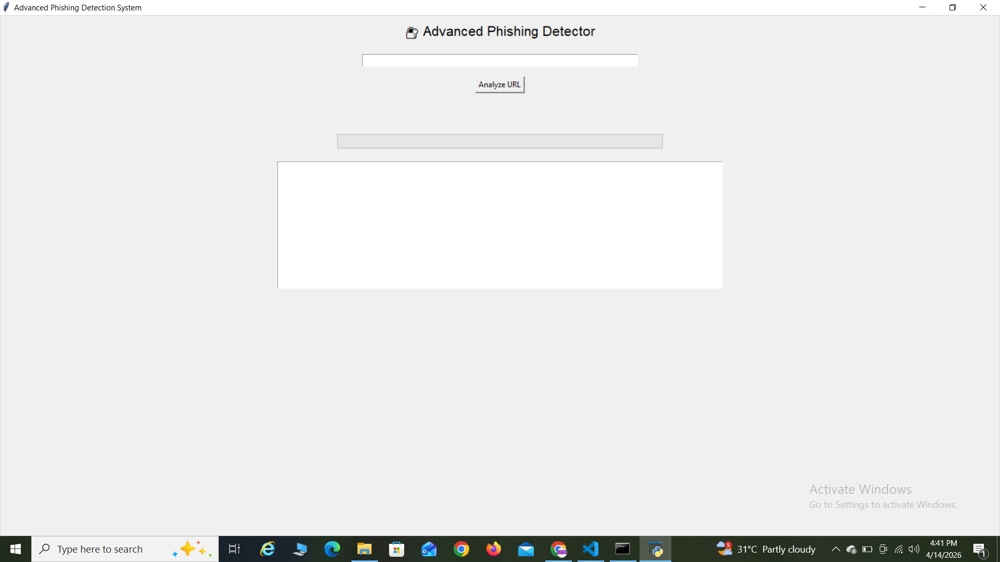
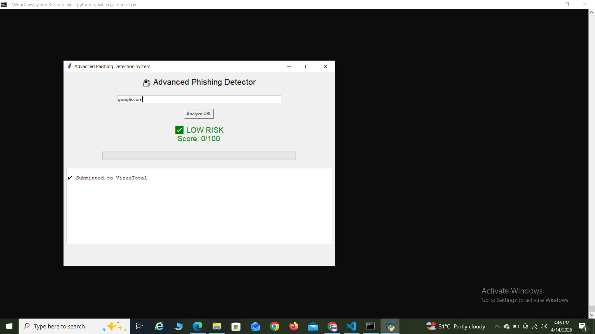
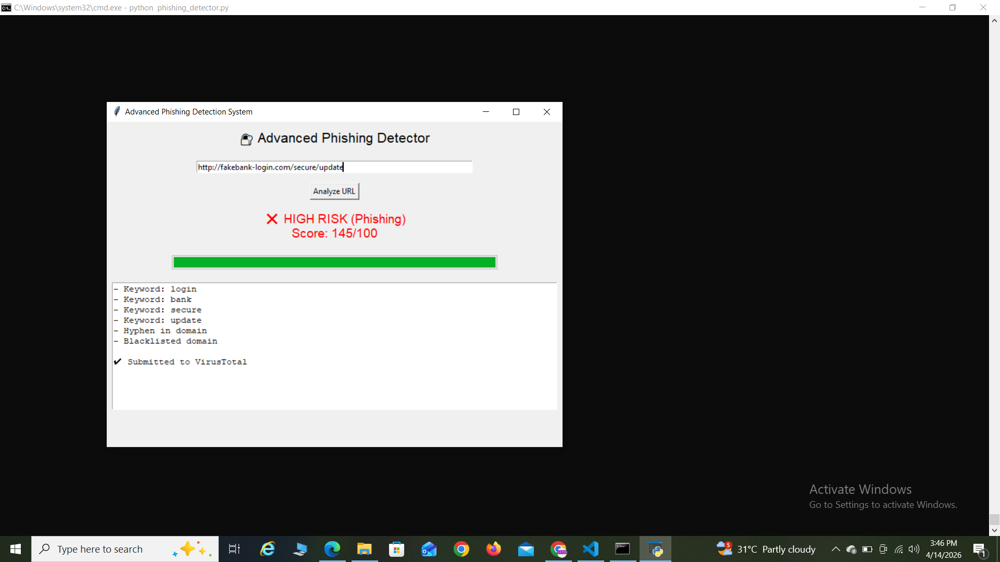

## "Advanced Phishing Detection System"

## Description
This project is a cybersecurity tool that detects phishing URLs using a hybrid approach combining heuristic analysis, blacklist checking, and threat intelligence API integration.

## Features
- URL analysis using multiple security rules
- Threat scoring system (0–100)
- Risk classification (Low, Medium, High)
- GUI-based interface using Tkinter
- Real-time VirusTotal API integration
- Blacklist-based detection
- Scan history logging

## Technologies Used
- Python
- Tkinter (GUI)
- Requests (API integration)

## How to Run
1. Install dependencies:
   pip install requests
2. Run the tool:
   python phishing_detector.py

## proof:
interface:

LOW RISK URL Detection:

HIGH RISK URL Detection:

   
## Detection Logic
- URL length analysis
- Suspicious keywords detection
- IP-based URL detection
- Subdomain analysis
- Blacklist matching
- Threat scoring system

## Author
MOHD EHSAN MUZAMMIL 
